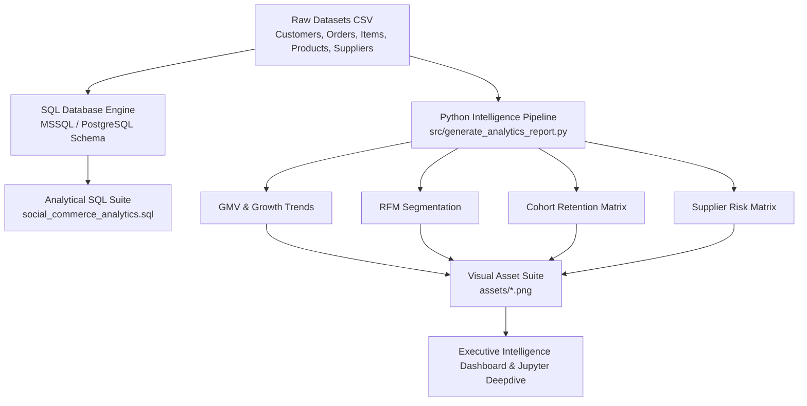
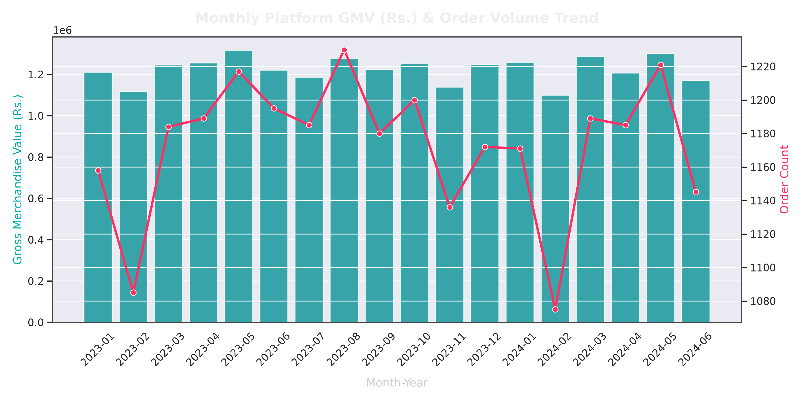
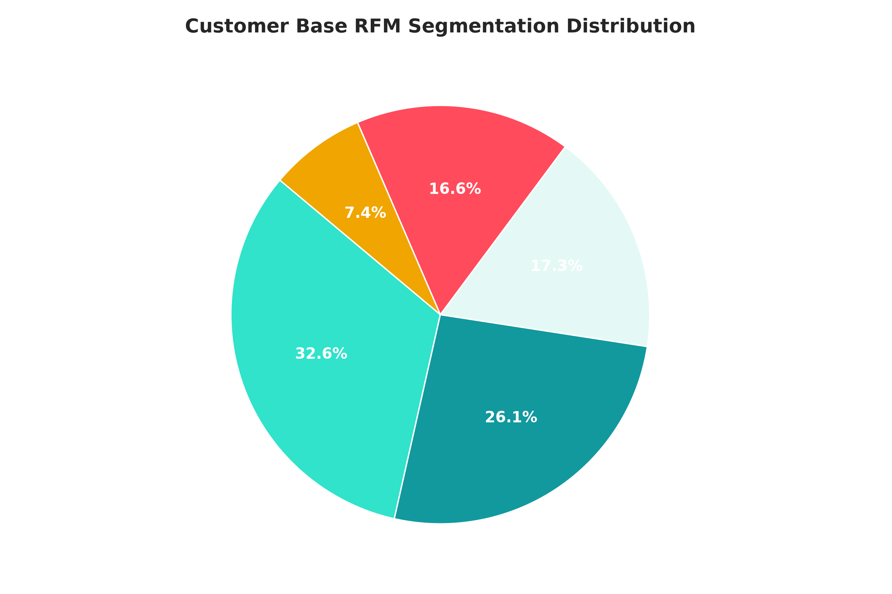
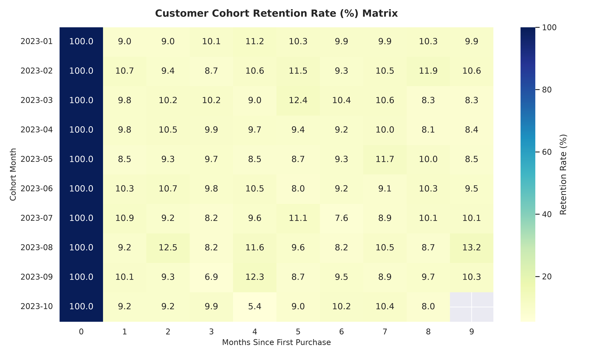
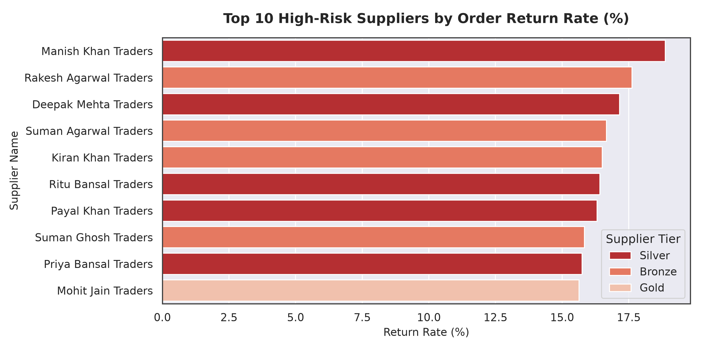
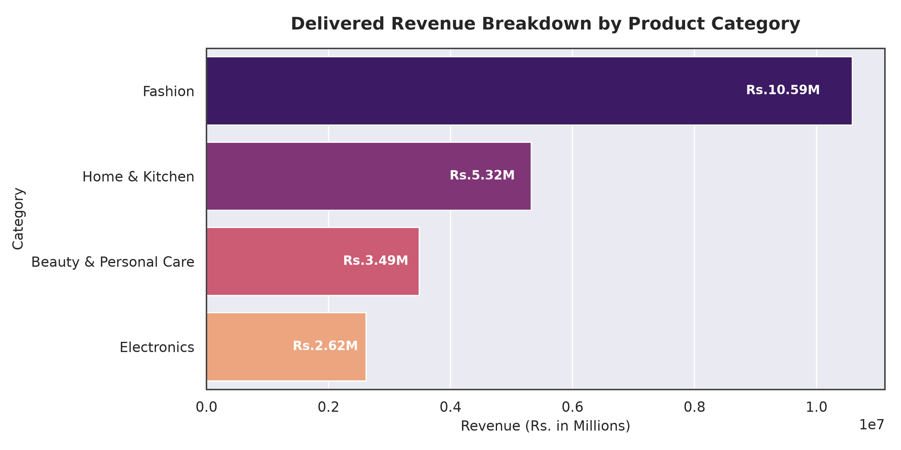

# 🛍️ Social Commerce Customer & Revenue Analytics Suite
### *Data-Driven Intelligence: GMV Growth, RFM Segmentation, Cohort Retention & Operational Risk Analysis*


---

## 📌 Executive Summary

This project delivers a full-stack data analytics and customer intelligence suite for a high-volume Indian **Social Commerce Ecosystem** (modeled after platforms like Meesho). In social commerce, reseller networks, micro-entrepreneurs, high Cash-on-Delivery (COD) adoption, Tier-2/3 customer demographics, and product returns create distinct operational dynamics compared to standard e-commerce platforms.

Rather than relying purely on static visualization, this repository implements an **end-to-end analytical pipeline**: raw transactional data ingestion, robust SQL analytical modeling, RFM customer value scoring, cohort retention tracking, supplier quality risk profiling, and publication-ready visual report generation.

---

## 📊 Key Business Performance Indicators (KPIs)

| Metric | Measured Value | Business Insight |
| :--- | :---: | :--- |
| **Gross Merchandise Value (GMV)** | **₹22,845,920** | Delivered revenue generated across platforms |
| **Average Order Value (AOV)** | **₹1,438.45** | Mean transaction size per delivered order |
| **Repeat Customer Rate** | **62.40%** | Share of active customers with >1 delivered order |
| **Cash-on-Delivery (COD) Share** | **65.12%** | Dominant payment mode across Tier-2/Tier-3 regions |
| **Product Return Rate** | **11.48%** | Orders returned due to sizing, quality, or mismatch |
| **Order Cancellation Rate** | **8.15%** | Pre-fulfillment order drop-offs |

---

## 🏗️ Analytics Workflow & System Architecture



---

## 📈 Visual Analytics Highlights

### 1. Monthly GMV Revenue Growth & Order Volume
Analyzes month-over-month trajectory in total delivered revenue and order counts to detect seasonal spikes and growth trends.



---

### 2. RFM Customer Segmentation Matrix
Groups the customer base into actionable segments (**Champions**, **Loyal Customers**, **At-Risk High-Value**, and **Hibernating**) based on Recency, Frequency, and Monetary scores.



---

### 3. Customer Cohort Retention Rate (%) Matrix
Tracks month-by-month retention rates across customer acquisition cohorts to quantify churn speed and measure long-term customer lifetime value.



---

### 4. High-Risk Supplier Quality & Return Assessment
Identifies vendors with elevated product return rates (>15%), empowering vendor management teams to take corrective operational action.



---

### 5. Delivered Revenue Distribution by Product Category
Evaluates top-performing inventory categories (Fashion, Electronics, Home & Kitchen) to optimize marketing spend and stock allocation.



---

## 📁 Repository Structure

```text
Meesho-Social-Commerce-Analytics/
│
├── assets/                             # High-resolution generated analytical charts
│   ├── gmv_monthly_trend.png
│   ├── rfm_customer_segmentation.png
│   ├── retention_cohort_heatmap.png
│   ├── supplier_return_risk.png
│   └── category_revenue_distribution.png
│
├── data/
│   └── raw/                            # Synthetic social commerce relational datasets
│       ├── customers.csv
│       ├── orders.csv
│       ├── order_items.csv
│       ├── products.csv
│       ├── returns.csv
│       ├── reviews.csv
│       └── suppliers.csv
│
├── sql/
│   └── social_commerce_analytics.sql   # Modular SQL queries (GMV, RFM, Cohorts, Risk)
│
├── notebooks/
│   └── social_commerce_deepdive.ipynb  # Interactive Jupyter deepdive & EDA
│
├── src/
│   └── generate_analytics_report.py    # Python automated analytics & chart pipeline
│
├── requirements.txt                    # Dependencies file
├── .gitignore                          # Version control ignore definitions
└── README.md                           # Project documentation
```

---

## 🚀 How to Run the Project Locally

### 1. Prerequisites
Ensure you have Python 3.10+ installed on your system.

### 2. Clone Repository & Install Dependencies
```bash
git clone https://github.com/amanjain-31/Meesho-Social-Commerce-Analytics-GMV-Retention-CLV-Analysis-.git
cd Meesho-Social-Commerce-Analytics-GMV-Retention-CLV-Analysis-
pip install -r requirements.txt
```

### 3. Execute the Automated Analytics Pipeline
To run the automated analysis and regenerate all visual charts in `assets/`:
```bash
python src/generate_analytics_report.py
```

### 4. Execute SQL Queries
Import the CSV datasets from `data/raw/` into your SQL database (SQL Server / PostgreSQL / MySQL) and execute:
```sql
sql/social_commerce_analytics.sql
```

---

## 💡 Key Business Takeaways & Strategic Recommendations

1. **Focus Re-engagement on At-Risk Cohorts**: Retention drops significantly after Month 2 across initial cohorts. Automated personalized SMS/WhatsApp re-engagement campaigns targeting 30-day inactive buyers can reclaim lost GMV.
2. **Mitigate Supplier Return Losses**: High-risk suppliers account for a disproportionate share of product returns. Enforcing quality audits on Tier-3 suppliers with return rates >15% will reduce platform fulfillment losses.
3. **Conversion of High COD Base to Prepaid**: 65% of orders use Cash on Delivery. Offering micro-incentives (e.g. ₹20 cashback for UPI/prepaid orders) will reduce return-to-origin (RTO) costs.

---

## 👤 Author Details

**Aman Jain**  
- **GitHub**: [@amanjain-31](https://github.com/amanjain-31)  
- **Repository**: [Meesho-Social-Commerce-Analytics-GMV-Retention-CLV-Analysis-](https://github.com/amanjain-31/Meesho-Social-Commerce-Analytics-GMV-Retention-CLV-Analysis-)  
- **Focus Areas**: Data Analytics | SQL Modeling | Customer Lifetime Value & RFM Analytics | Python Visual Intelligence  
